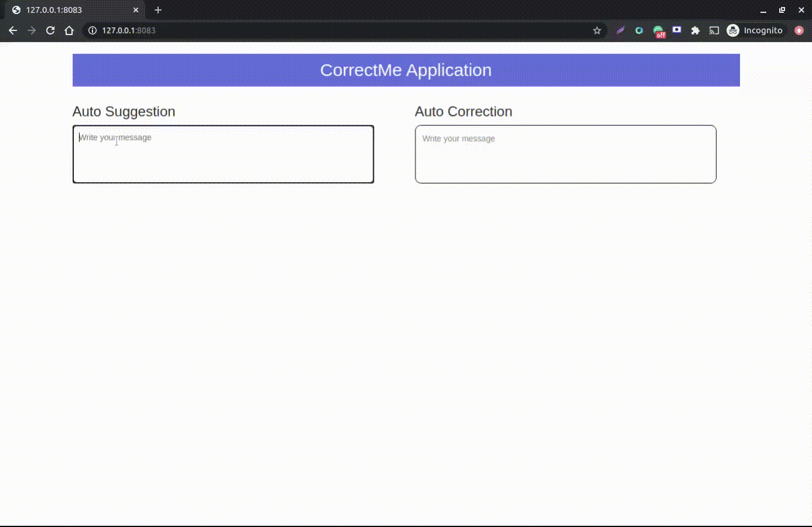
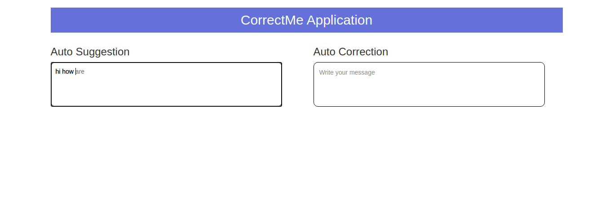

# CorrectMe
This Project contains two API one is auto-corrections and autosuggestions.
Auto-correction build with the help of text blob library and other one is auto-suggestions with the help of transforms and Bart large model.

## Project Intro

The purpose of this project is to train the next word predicting models. Models should be able to suggest the next word after the user has input word/words auto-correct the incorrect word/s like Gmail and Grammarly doing.
Autocorrect the incorrect word in the input field.

### Methods Used
* Language Prediction
* Natural Language Processing
* Transformers Bart Model
* Textblob

### Technologies
* Python
* Python Flask
* Torch, Transforms
* JS, HTML

## Project Description
* `app.py` - In that file three APIs are there, one is auto_correction and the second one is auto_suggestion and the last one is index file rendering file.
* `main.py` - use pre-trained Bart model for next word prediction

## Process Flow
- Frontend development
- Data Collection
- Data Processing/Cleaning
- Words Tokenizing
- Model Training
- Demo development

## Getting Started

### Prerequisites
1. Create a python virtual environment via command
`virtualenv correctme_env -p python3`

2. Install python dependencies via command
`pip3 install -r requirement.txt`

3. Start server via command `python3 app.py`.

4. Open your browser at http://127.0.0.1:8083/

# Authors

* **Deepak Chawla** - [Linkedin](https://www.linkedin.com/in/deepakchawla1307/)

# Achievement

I launched a standard hashtag for the data science
community named #geekeedatascience. A Hashtag For Community To Learn, Build, And Command

Anyone can use #geekeedatascience to categorize your message into your post, picture, and contents. By which you can participate in a discussion on your social media platform with the best minds of Data Scientist in the world. And you can discover yourself with new conceptual knowledge in the science of data. Make use of this #geekeedatascience to reach people.

* **For more details click [here](https://geekeedatascience.com/)**
* **[Instagram](https://www.instagram.com/geekeedatascience/)
[Linkedin](https://www.linkedin.com/in/geekeedatascience/) [Twitter](https://twitter.com/GDatascience)
[Facebook](https://www.facebook.com/Geekeedatascience-105980804425336)**

# License

This project is licensed under the MIT License - see the [LICENSE.md](LICENSE.md) file for details

# Acknowledgments

* Hat tip to anyone who’s code was used
* Inspiration